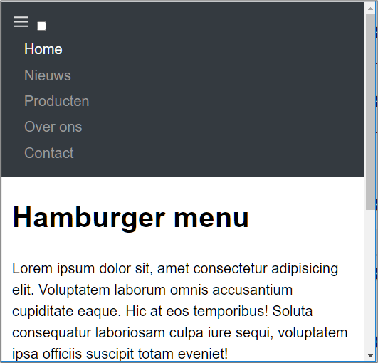
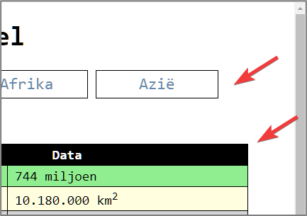
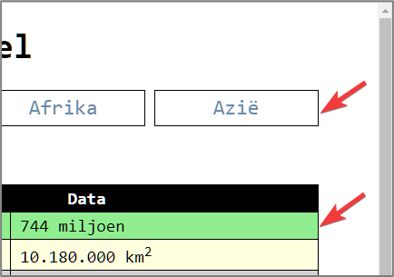
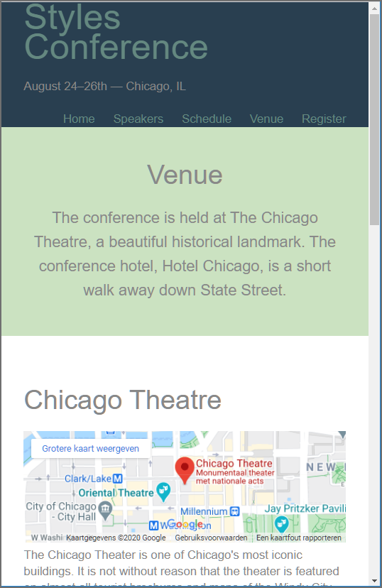
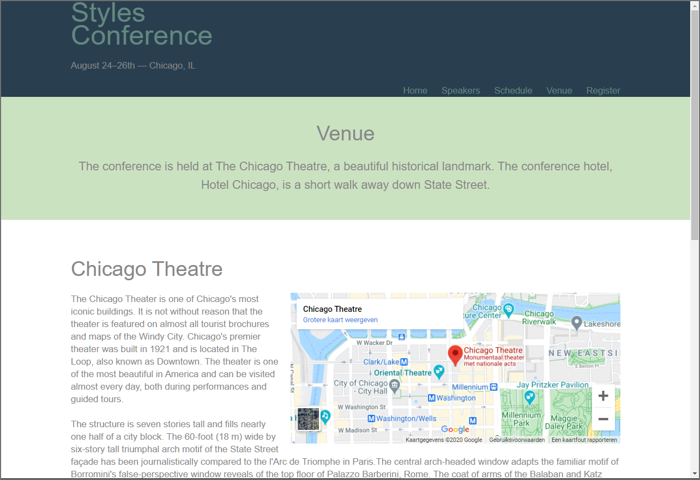
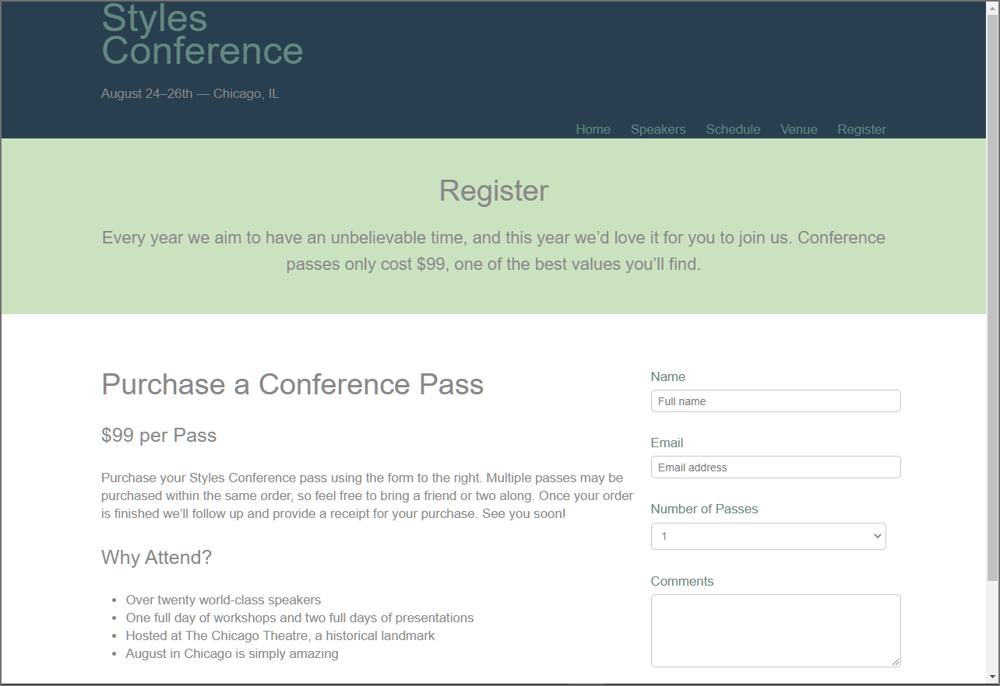

## Oefening 1 - Hamburger menu

- Open de map **oefening1**.

In onderstaande animated gif wordt de webpagina getoond die je in deze oefening moet maken:

- Stel voor de webpagina:
  - een iets groter standaard lettertype in bijv. 1,2 em
  - stel de **font-family** in op **sans-serif**
  - voorzien wat ademruimte tussen de verschillende regels (regelhoogte 1,5)

- Opmaak nav-element:
  - stel de tekstkleur van het nav-element in op \#cccccc en stel de achtergrondkleur in op #343a40
  - stel de margin van het body-element in op nul, zodat het nav-element
    de volledige breedte van de webpagina kan innemen.
  - Voorzie een beetje witruimte bij het nav-element (14 pixels padding) en bij het main-element (14 pixels padding links en rechts). 

- Maak de hyperlinks op in het nav-element:
  - stel de tekstkleur van de hyperlinks in op \#9a9a9a
  - enkel als men hovert over de links mogen deze onderstreept worden, anders niet.
  - de tekstkleur voor de 'active' link is wit en als men de muis beweegt over deze link mag deze niet onderstreept worden.

- Afwerken verticale navigatiebalk:
  - verwijder de 'bullets', margin en padding van het ul-element
  - maak van de hyperlinks block-elementen zodat deze even breed worden als de li-elementen en voorzie een beetje extra witruimte (padding: 3px 16px)

Te bekomen resultaat:

Een uitklapbaar hamburger-menu maakt men meestal met behulp van JavaScript, maar door handig gebruik te maken van de **:checked** pseudo-class kan je ook met alleen CSS een uitklapbaar hamburger-menu maken (zie ook boekvoorbeeld: 11_01.html).

Maak als volgt het hamburger-menu interactief:
  - Stel voor de hamburger-afbeelding de muisaanwijzer in op 'pointer'.
  - Verberg standaard het menu (ul-element).
  - Zorg ervoor dat het menu (ul-element) zichtbaar is als de checkbox aangevinkt is. 
  **Tip** Gebruik de **:checked** pseudo-class op een creatieve manier
  - Verberg het selectievakje, want we kunnen door op het label (bevat ook het hamburger-icon) te klikken ook het selectievakje af- en aanvinken, bijgevolg hoeft dit niet zichtbaar te zijn.

In desktop view beperk je de breedte van het main-element tot 640 pixels en centreer je dit element tussen de marges. 

Als de layout viewport minimaal 576 pixels is zorg je ervoor dat het hamburger-menu vervangen wordt door een horizontaal menu:
  -  maak het menu (ul-element) zichtbaar
  -  plaats de li-elementen naast elkaar en pas de witruimte van de li-elementen aan (padding: 0 7px)
  -  verberg het label dat het hamburger-icon bevat.

## Oefening 2 - Werelddelen - horizontal nav floats

- Open de map **oefening2**.
- In het startbestand wordt gebruikgemaakt van `display: inline-block` om de li-elementen in het nav-element horizontaal naast elkaar te plaatsen. Met deze techniek is het niet mogelijk om de rechterzijde van de nav mooi uit te lijnen met de rechterzijde van de tabel (zie linkse schermafbeelding hieronder). Dit omdat de witruimtes tussen de boxen de spaties zijn tussen de inline-elementen. 

<table border="0">
  <tr>
    <th>Horizontal menu: inline-block</th>
    <th>Horizontal menu: float</th>
  </tr>
  <tr>
    <td style="border:none">
                
    </td>
    <td style="border:none">
        
    </td>
  </tr>
</table>

Dit is wel mogelijk door gebruik te maken van floats (zie rechtse schermafbeelding hierboven). 

Voer dit uit en hou hierbij rekening met volgende aanwijzigen/tips:

  - maak elk navigatie-item 16% breed en voorzie 0,8% witruimte tussen de items (16% * 6 + 0,8% * 5 = 100%).
  - merk op dat als je alle li-elementen 'float', het ul-element volledig zal 'collapsen', omdat dit op dat moment alleen nog 'floats' bevat. Gebruik de meest moderne werkwijze om de 'container collapse' te voorkomen.

***Opmerking*** De hierboven gebruikte techniek vind je nog terug op veel websites, maar de moderne manier om dit te doen is gebruikmaken van flex of grid (zie volgende lessen).
 
## Oefening 3 Styles Conference - Responsive

- Open de map **les8StylesConference**.
- We werken terug Mobile First.
  - **Venue webpagina** 
     De iframes op deze webpagina moeten op een Mobile device de volledige ruimte innemen (zie schermafbeelding **Venue Mobile**)
     en vanaf een viewport 960px mogen de iframes nog slechts 60% van de ruimte innemen en moet de tekst errond 'floaten' (zie schermafbeelding **Venue 960px**). 
     Stel tevens de hoogte van het iframe in op 264 pixels en zorg links en onderaan voor een beetje witruimte.
  - **Register webpagina** 
    Vanaf een viewport 960px moet de register-info section en het formulier naast elkaar geplaatst worden (zie schermafbeelding **Register 960px**). De register-info section neemt 70% van de ruimte in en het formulier de overige 30%.

  **Schermafbeelding: Venue Mobile**

  

  **Schermafbeelding: Venue 960px**

  

  **Schermafbeelding: Register 960px**

  
      
  

